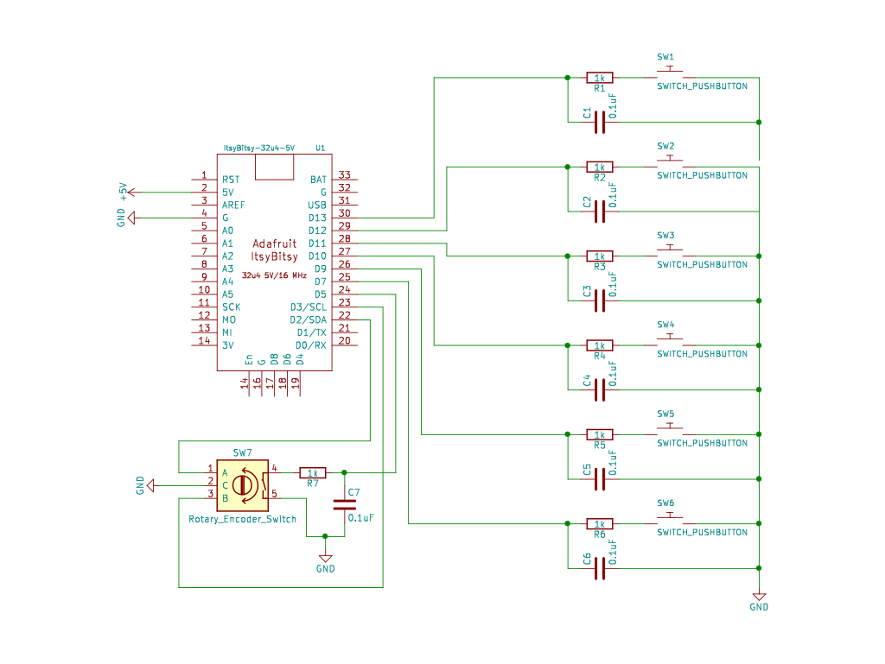

# ItsyBitsy DAW Controller

Uses an 32u4 Arduino microcontroller with 6 buttons and a rotary encoder (with switch) as a USB HID device to perform keyboard and mouse commands to control a DAW, namely REAPER.

In order to use, add Shift+Mousewheel to REAPER's jog control in the Action List.

